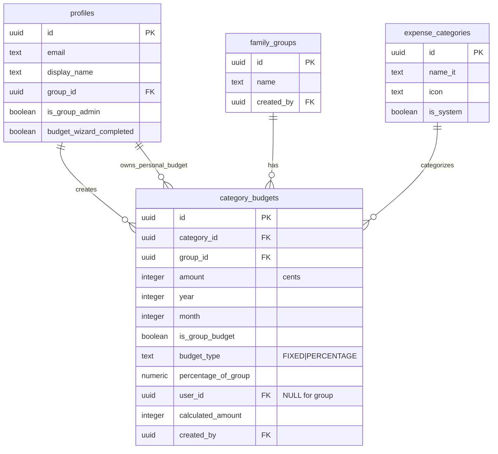
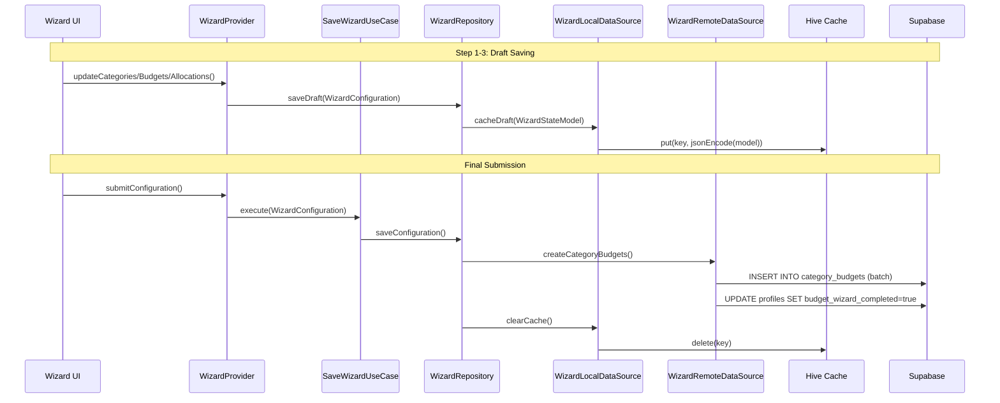

# Data Model: Group Budget Setup Wizard

**Feature**: 001-group-budget-wizard
**Phase**: 1 (Design Artifacts)
**Date**: 2026-01-09

---

## Overview

This document defines the complete data architecture for the Group Budget Setup Wizard feature, including database schema changes, domain entities, data models, and validation rules. The design follows Clean Architecture principles with clear separation between domain (business logic) and data (persistence) layers.

**Key Principles**:
- All monetary values stored as INTEGER cents (e.g., €50.00 = 5000) to avoid floating-point errors
- Hive cache for temporary wizard state (24-hour expiry per research.md Decision 1)
- Existing `category_budgets` table handles historical data via year/month composite key
- No breaking changes to existing schema

---

## 1. Database Schema Changes

### 1.1 Migration: Add Wizard Completion Tracking

**Migration File**: `supabase/migrations/060_add_wizard_completion_tracking.sql`

```sql
-- Migration: Add wizard completion tracking to profiles table
-- Feature: Group Budget Setup Wizard (001)
-- Task: T001

-- Add budget_wizard_completed column to profiles table
ALTER TABLE public.profiles
ADD COLUMN IF NOT EXISTS budget_wizard_completed BOOLEAN NOT NULL DEFAULT FALSE;

-- Create index for routing guards (frequent check on login)
CREATE INDEX IF NOT EXISTS idx_profiles_wizard_completed
  ON public.profiles(id, budget_wizard_completed)
  WHERE is_group_admin = true;

-- Add comment
COMMENT ON COLUMN public.profiles.budget_wizard_completed IS
  'Tracks if group admin has completed mandatory budget setup wizard';
```

**Justification**:
- Enables router guard logic (research.md Decision 5: hard block behavior)
- Index covers admin-only wizard checks (avoids full table scan on login)
- DEFAULT FALSE ensures existing admins are prompted on first login

---

### 1.2 Existing Schema Relationships

The wizard leverages existing tables without modification:

```sql
-- Profiles table (extends auth.users)
public.profiles (
  id UUID PRIMARY KEY,
  email TEXT NOT NULL,
  display_name TEXT NOT NULL,
  group_id UUID REFERENCES family_groups(id),
  is_group_admin BOOLEAN DEFAULT false,
  budget_wizard_completed BOOLEAN DEFAULT false,  -- NEW FIELD
  -- ... other fields
)

-- Category budgets (migration 026 + 037)
public.category_budgets (
  id UUID PRIMARY KEY,
  category_id UUID REFERENCES expense_categories(id),
  group_id UUID REFERENCES family_groups(id),
  amount INTEGER NOT NULL,  -- Stored in cents
  year INTEGER NOT NULL CHECK (year >= 2000),
  month INTEGER NOT NULL CHECK (month >= 1 AND month <= 12),
  is_group_budget BOOLEAN NOT NULL,
  budget_type TEXT NOT NULL DEFAULT 'FIXED',  -- 'FIXED' or 'PERCENTAGE'
  percentage_of_group NUMERIC(5,2),  -- For member allocations
  user_id UUID REFERENCES profiles(id),  -- NULL for group budgets
  calculated_amount INTEGER,  -- Auto-calculated for percentage budgets
  created_by UUID NOT NULL REFERENCES profiles(id),
  created_at TIMESTAMPTZ DEFAULT now(),
  updated_at TIMESTAMPTZ DEFAULT now(),

  UNIQUE(category_id, group_id, year, month, is_group_budget, user_id)
)

-- Expense categories (migration 013)
public.expense_categories (
  id UUID PRIMARY KEY,
  name_it TEXT NOT NULL,  -- Italian display name
  icon TEXT,
  color TEXT,
  is_system BOOLEAN DEFAULT false,
  created_at TIMESTAMPTZ DEFAULT now()
)
```

**Relationships Diagram**:



---

### 1.3 Hive Cache Schema

**Cache Box**: `WizardStateCache` (registered in `main.dart`)

**Cache Entry Structure**:

```dart
// Cache key format: wizard_draft_{group_id}_{admin_user_id}
{
  "group_id": "uuid-string",
  "admin_user_id": "uuid-string",
  "current_step": 2,  // 0-based step index
  "selected_category_ids": ["uuid1", "uuid2", "uuid3"],
  "category_budgets": {
    "uuid1": 50000,  // €500.00 in cents
    "uuid2": 30000,  // €300.00 in cents
    "uuid3": 20000   // €200.00 in cents
  },
  "member_allocations": {
    "member_uuid1": 50.00,  // Percentage as decimal
    "member_uuid2": 30.00,
    "member_uuid3": 20.00
  },
  "timestamp": "2026-01-09T10:30:00.000Z"
}
```

**Cache Operations**:
- **Write**: On each wizard step completion or when user navigates back
- **Read**: On wizard initialization if draft exists and timestamp < 24 hours
- **Delete**: On wizard completion, explicit cancel, or 24-hour expiry
- **Expiry Check**: Performed by `WizardLocalDataSource` (pattern from `dashboard_local_datasource.dart`)

---

## 2. Domain Entities

Domain entities represent pure business logic without framework dependencies. Located in `lib/features/budgets/wizard/domain/entities/`.

### 2.1 WizardConfiguration Entity

```dart
import 'package:equatable/equatable.dart';

/// Wizard configuration entity representing complete budget setup.
///
/// This is the aggregate root for the wizard domain, combining category
/// selections, budget allocations, and member percentage distributions.
class WizardConfiguration extends Equatable {
  const WizardConfiguration({
    required this.groupId,
    required this.selectedCategories,
    required this.categoryBudgets,
    required this.memberAllocations,
    this.currentStep = 0,
  });

  /// The family group ID this configuration belongs to
  final String groupId;

  /// List of selected expense category IDs (step 1 selection)
  final List<String> selectedCategories;

  /// Budget amounts per category in cents
  /// Key: category_id, Value: amount in cents (e.g., 50000 = €500.00)
  final Map<String, int> categoryBudgets;

  /// Member allocation percentages (must sum to 100.00%)
  /// Key: user_id, Value: percentage (e.g., 33.33)
  final Map<String, double> memberAllocations;

  /// Current wizard step index (0-based)
  final int currentStep;

  /// Validate configuration completeness
  bool get isValid {
    return selectedCategories.isNotEmpty &&
           categoryBudgets.length == selectedCategories.length &&
           _isBudgetAmountsValid() &&
           _isMemberAllocationsValid();
  }

  /// Check if all budget amounts are positive
  bool _isBudgetAmountsValid() {
    return categoryBudgets.values.every((amount) => amount > 0);
  }

  /// Check if member allocations sum to exactly 100%
  bool _isMemberAllocationsValid() {
    if (memberAllocations.isEmpty) return false;
    final total = memberAllocations.values.fold(0.0, (sum, val) => sum + val);
    // Allow ±0.01% tolerance for floating-point rounding
    return (total - 100.0).abs() <= 0.01;
  }

  /// Get total group budget across all categories
  int get totalGroupBudget {
    return categoryBudgets.values.fold(0, (sum, amount) => sum + amount);
  }

  /// Create a copy with updated fields
  WizardConfiguration copyWith({
    String? groupId,
    List<String>? selectedCategories,
    Map<String, int>? categoryBudgets,
    Map<String, double>? memberAllocations,
    int? currentStep,
  }) {
    return WizardConfiguration(
      groupId: groupId ?? this.groupId,
      selectedCategories: selectedCategories ?? this.selectedCategories,
      categoryBudgets: categoryBudgets ?? this.categoryBudgets,
      memberAllocations: memberAllocations ?? this.memberAllocations,
      currentStep: currentStep ?? this.currentStep,
    );
  }

  @override
  List<Object?> get props => [
        groupId,
        selectedCategories,
        categoryBudgets,
        memberAllocations,
        currentStep,
      ];

  @override
  String toString() {
    return 'WizardConfiguration(groupId: $groupId, '
           'categories: ${selectedCategories.length}, '
           'totalBudget: €${totalGroupBudget / 100}, '
           'members: ${memberAllocations.length})';
  }
}
```

---

### 2.2 BudgetAllocation Entity

```dart
import 'package:equatable/equatable.dart';

/// Budget allocation entity representing a single category budget.
///
/// Used internally by wizard to manage individual category configurations
/// before persisting to category_budgets table.
class BudgetAllocation extends Equatable {
  const BudgetAllocation({
    required this.categoryId,
    required this.categoryName,
    required this.amountCents,
    this.icon,
    this.color,
  });

  /// Expense category ID
  final String categoryId;

  /// Italian category name (e.g., "Cibo e Spesa")
  final String categoryName;

  /// Budget amount in cents (e.g., 50000 = €500.00)
  final int amountCents;

  /// Optional Material icon name
  final String? icon;

  /// Optional hex color code
  final String? color;

  /// Convert cents to euro string (e.g., "500,00 €")
  String get amountEuro {
    final euros = amountCents / 100;
    return '${euros.toStringAsFixed(2).replaceAll('.', ',')} €';
  }

  /// Validate amount is positive
  bool get isValid => amountCents > 0;

  /// Create a copy with updated fields
  BudgetAllocation copyWith({
    String? categoryId,
    String? categoryName,
    int? amountCents,
    String? icon,
    String? color,
  }) {
    return BudgetAllocation(
      categoryId: categoryId ?? this.categoryId,
      categoryName: categoryName ?? this.categoryName,
      amountCents: amountCents ?? this.amountCents,
      icon: icon ?? this.icon,
      color: color ?? this.color,
    );
  }

  @override
  List<Object?> get props => [categoryId, categoryName, amountCents, icon, color];

  @override
  String toString() {
    return 'BudgetAllocation(category: $categoryName, amount: $amountEuro)';
  }
}
```

---

### 2.3 CategorySelection Entity

```dart
import 'package:equatable/equatable.dart';

/// Category selection entity representing a selected expense category in wizard.
///
/// Lightweight entity for wizard step 1 (category selection) before
/// budget amounts are assigned.
class CategorySelection extends Equatable {
  const CategorySelection({
    required this.categoryId,
    required this.categoryName,
    this.icon,
    this.color,
    this.isSystemCategory = false,
  });

  /// Expense category ID
  final String categoryId;

  /// Italian category name
  final String categoryName;

  /// Material icon name
  final String? icon;

  /// Hex color code
  final String? color;

  /// Whether this is a system-defined category (cannot be deleted)
  final bool isSystemCategory;

  /// Create a copy with updated fields
  CategorySelection copyWith({
    String? categoryId,
    String? categoryName,
    String? icon,
    String? color,
    bool? isSystemCategory,
  }) {
    return CategorySelection(
      categoryId: categoryId ?? this.categoryId,
      categoryName: categoryName ?? this.categoryName,
      icon: icon ?? this.icon,
      color: color ?? this.color,
      isSystemCategory: isSystemCategory ?? this.isSystemCategory,
    );
  }

  @override
  List<Object?> get props => [categoryId, categoryName, icon, color, isSystemCategory];

  @override
  String toString() {
    return 'CategorySelection(id: $categoryId, name: $categoryName)';
  }
}
```

---

## 3. Data Models (JSON Serialization)

Data models extend domain entities and add JSON serialization for API/cache persistence. Located in `lib/features/budgets/wizard/data/models/`.

### 3.1 WizardStateModel

```dart
import '../../domain/entities/wizard_configuration.dart';

/// Wizard state model for JSON serialization/deserialization.
///
/// Extends WizardConfiguration entity with Hive cache persistence capabilities.
class WizardStateModel extends WizardConfiguration {
  const WizardStateModel({
    required super.groupId,
    required super.selectedCategories,
    required super.categoryBudgets,
    required super.memberAllocations,
    super.currentStep,
    this.timestamp,
  });

  /// Cache timestamp for expiry calculation
  final DateTime? timestamp;

  /// Create from JSON (Hive cache format)
  factory WizardStateModel.fromJson(Map<String, dynamic> json) {
    return WizardStateModel(
      groupId: json['group_id'] as String,
      selectedCategories: List<String>.from(json['selected_category_ids'] as List),
      categoryBudgets: Map<String, int>.from(
        (json['category_budgets'] as Map).map(
          (key, value) => MapEntry(key as String, value as int),
        ),
      ),
      memberAllocations: Map<String, double>.from(
        (json['member_allocations'] as Map).map(
          (key, value) => MapEntry(key as String, (value as num).toDouble()),
        ),
      ),
      currentStep: json['current_step'] as int? ?? 0,
      timestamp: json['timestamp'] != null
          ? DateTime.parse(json['timestamp'] as String)
          : null,
    );
  }

  /// Convert to JSON (Hive cache format)
  Map<String, dynamic> toJson() {
    return {
      'group_id': groupId,
      'selected_category_ids': selectedCategories,
      'category_budgets': categoryBudgets,
      'member_allocations': memberAllocations,
      'current_step': currentStep,
      'timestamp': (timestamp ?? DateTime.now()).toIso8601String(),
    };
  }

  /// Check if cache is expired (>24 hours old)
  bool get isExpired {
    if (timestamp == null) return true;
    return DateTime.now().difference(timestamp!).inHours >= 24;
  }

  /// Create from domain entity
  factory WizardStateModel.fromEntity(WizardConfiguration entity) {
    return WizardStateModel(
      groupId: entity.groupId,
      selectedCategories: entity.selectedCategories,
      categoryBudgets: entity.categoryBudgets,
      memberAllocations: entity.memberAllocations,
      currentStep: entity.currentStep,
      timestamp: DateTime.now(),
    );
  }

  /// Convert to domain entity
  WizardConfiguration toEntity() {
    return WizardConfiguration(
      groupId: groupId,
      selectedCategories: selectedCategories,
      categoryBudgets: categoryBudgets,
      memberAllocations: memberAllocations,
      currentStep: currentStep,
    );
  }

  @override
  WizardStateModel copyWith({
    String? groupId,
    List<String>? selectedCategories,
    Map<String, int>? categoryBudgets,
    Map<String, double>? memberAllocations,
    int? currentStep,
    DateTime? timestamp,
  }) {
    return WizardStateModel(
      groupId: groupId ?? this.groupId,
      selectedCategories: selectedCategories ?? this.selectedCategories,
      categoryBudgets: categoryBudgets ?? this.categoryBudgets,
      memberAllocations: memberAllocations ?? this.memberAllocations,
      currentStep: currentStep ?? this.currentStep,
      timestamp: timestamp ?? this.timestamp,
    );
  }
}
```

---

### 3.2 MemberAllocationModel

```dart
/// Member allocation model for JSON serialization.
///
/// Represents a single member's budget percentage allocation.
class MemberAllocationModel {
  const MemberAllocationModel({
    required this.userId,
    required this.displayName,
    required this.percentage,
  });

  /// User ID from profiles table
  final String userId;

  /// User's display name
  final String displayName;

  /// Allocation percentage (0-100, e.g., 33.33)
  final double percentage;

  /// Create from JSON
  factory MemberAllocationModel.fromJson(Map<String, dynamic> json) {
    return MemberAllocationModel(
      userId: json['user_id'] as String,
      displayName: json['display_name'] as String,
      percentage: (json['percentage'] as num).toDouble(),
    );
  }

  /// Convert to JSON
  Map<String, dynamic> toJson() {
    return {
      'user_id': userId,
      'display_name': displayName,
      'percentage': percentage,
    };
  }

  /// Validate percentage is within bounds
  bool get isValid => percentage >= 0 && percentage <= 100;

  @override
  String toString() {
    return 'MemberAllocation($displayName: ${percentage.toStringAsFixed(2)}%)';
  }
}
```

---

### 3.3 CategorySelectionModel

```dart
import '../../domain/entities/category_selection.dart';

/// Category selection model for JSON serialization.
///
/// Extends CategorySelection entity with API/cache serialization.
class CategorySelectionModel extends CategorySelection {
  const CategorySelectionModel({
    required super.categoryId,
    required super.categoryName,
    super.icon,
    super.color,
    super.isSystemCategory,
  });

  /// Create from JSON (expense_categories table row)
  factory CategorySelectionModel.fromJson(Map<String, dynamic> json) {
    return CategorySelectionModel(
      categoryId: json['id'] as String,
      categoryName: json['name_it'] as String,
      icon: json['icon'] as String?,
      color: json['color'] as String?,
      isSystemCategory: json['is_system'] as bool? ?? false,
    );
  }

  /// Convert to JSON
  Map<String, dynamic> toJson() {
    return {
      'id': categoryId,
      'name_it': categoryName,
      'icon': icon,
      'color': color,
      'is_system': isSystemCategory,
    };
  }

  /// Create from domain entity
  factory CategorySelectionModel.fromEntity(CategorySelection entity) {
    return CategorySelectionModel(
      categoryId: entity.categoryId,
      categoryName: entity.categoryName,
      icon: entity.icon,
      color: entity.color,
      isSystemCategory: entity.isSystemCategory,
    );
  }

  /// Convert to domain entity
  CategorySelection toEntity() {
    return CategorySelection(
      categoryId: categoryId,
      categoryName: categoryName,
      icon: icon,
      color: color,
      isSystemCategory: isSystemCategory,
    );
  }

  @override
  CategorySelectionModel copyWith({
    String? categoryId,
    String? categoryName,
    String? icon,
    String? color,
    bool? isSystemCategory,
  }) {
    return CategorySelectionModel(
      categoryId: categoryId ?? this.categoryId,
      categoryName: categoryName ?? this.categoryName,
      icon: icon ?? this.icon,
      color: color ?? this.color,
      isSystemCategory: isSystemCategory ?? this.isSystemCategory,
    );
  }
}
```

---

## 4. Data Flow Diagram



---

## 5. Validation Rules

All validation implemented in domain entities and use cases, enforced before persistence.

### 5.1 Category Selection Validation

| Rule | Constraint | Error Message (Italian) |
|------|-----------|------------------------|
| Minimum categories | `selectedCategories.length >= 1` | "Devi selezionare almeno una categoria" |
| Maximum categories | `selectedCategories.length <= 20` | "Puoi selezionare massimo 20 categorie" |
| Unique categories | No duplicates in list | "Categoria già selezionata" |

---

### 5.2 Budget Amount Validation

| Rule | Constraint | Error Message (Italian) |
|------|-----------|------------------------|
| Required | `amount != null` | "Inserisci un importo" |
| Positive | `amountCents > 0` | "L'importo deve essere maggiore di zero" |
| Maximum | `amountCents <= 99999999` | "Importo troppo elevato (max €999.999,99)" |
| All categories have budgets | `categoryBudgets.length == selectedCategories.length` | "Assegna un budget a tutte le categorie" |

**Implementation Example**:
```dart
// In BudgetAllocationValidator use case
class BudgetAllocationValidator {
  ValidationResult validate(Map<String, int> categoryBudgets, List<String> selectedCategories) {
    if (categoryBudgets.isEmpty) {
      return ValidationResult.failure('Nessun budget configurato');
    }

    if (categoryBudgets.length != selectedCategories.length) {
      return ValidationResult.failure('Assegna un budget a tutte le categorie');
    }

    for (final amount in categoryBudgets.values) {
      if (amount <= 0) {
        return ValidationResult.failure('L\'importo deve essere maggiore di zero');
      }
      if (amount > 99999999) {
        return ValidationResult.failure('Importo troppo elevato (max €999.999,99)');
      }
    }

    return ValidationResult.success();
  }
}
```

---

### 5.3 Member Allocation Validation

| Rule | Constraint | Error Message (Italian) |
|------|-----------|------------------------|
| Total must be 100% | `abs(sum - 100.0) <= 0.01` | "Il totale deve essere 100%" |
| Individual range | `0 <= percentage <= 100` | "La percentuale deve essere tra 0 e 100" |
| All members have allocation | `memberAllocations.length == groupMembers.length` | "Assegna una percentuale a tutti i membri" |
| At least one member | `memberAllocations.length >= 1` | "Deve esserci almeno un membro" |
| No negative values | `percentage >= 0` | "La percentuale non può essere negativa" |
| Decimal precision | Max 2 decimal places | "Usa massimo 2 decimali (es. 33.33)" |

**Implementation Example**:
```dart
// In MemberAllocationValidator use case
class MemberAllocationValidator {
  ValidationResult validate(Map<String, double> allocations) {
    if (allocations.isEmpty) {
      return ValidationResult.failure('Deve esserci almeno un membro');
    }

    final total = allocations.values.fold(0.0, (sum, val) => sum + val);
    if ((total - 100.0).abs() > 0.01) {
      return ValidationResult.failure(
        'Il totale deve essere 100% (attuale: ${total.toStringAsFixed(2)}%)'
      );
    }

    for (final percentage in allocations.values) {
      if (percentage < 0 || percentage > 100) {
        return ValidationResult.failure('La percentuale deve essere tra 0 e 100');
      }

      // Check max 2 decimal places
      final decimalCheck = (percentage * 100).round() / 100;
      if ((percentage - decimalCheck).abs() > 0.001) {
        return ValidationResult.failure('Usa massimo 2 decimali (es. 33.33)');
      }
    }

    return ValidationResult.success();
  }
}
```

---

## 6. Data Constraints Summary

| Constraint | Value | Justification |
|-----------|-------|---------------|
| Cache expiry | 24 hours | Typical household budget decision window (research.md Decision 1) |
| Max categories | 20 | Prevents UI overflow; 7 system categories + 13 custom sufficient |
| Max budget amount | €999,999.99 | Enterprise group support; stored as 99999999 cents |
| Min budget amount | €0.01 | Minimum currency unit; stored as 1 cent |
| Percentage precision | 2 decimals | Allows 33.33% for 3-member splits without rounding errors |
| Percentage total tolerance | ±0.01% | Accommodates floating-point rounding (e.g., 33.33 × 3 = 99.99%) |
| Wizard steps | 4 total | Category select → Budget amounts → Member % → Confirmation |

---

## 7. Migration Rollback Plan

If migration 060 needs to be rolled back:

```sql
-- Rollback migration 060
ALTER TABLE public.profiles
DROP COLUMN IF EXISTS budget_wizard_completed;

DROP INDEX IF EXISTS idx_profiles_wizard_completed;
```

**Impact Assessment**:
- No data loss (column only tracks completion flag)
- Admins will see wizard again on next login (acceptable UX degradation)
- No cascade effects (column not referenced in foreign keys)

---

## 8. Testing Data Fixtures

### 8.1 Sample Wizard Configuration (Test)

```dart
final testWizardConfig = WizardConfiguration(
  groupId: 'test-group-uuid',
  selectedCategories: [
    'cibo-uuid',
    'trasporto-uuid',
    'casa-uuid',
  ],
  categoryBudgets: {
    'cibo-uuid': 50000,      // €500.00
    'trasporto-uuid': 30000, // €300.00
    'casa-uuid': 20000,      // €200.00
  },
  memberAllocations: {
    'admin-uuid': 50.00,    // 50%
    'member1-uuid': 30.00,  // 30%
    'member2-uuid': 20.00,  // 20%
  },
  currentStep: 3,
);
```

### 8.2 Sample Cache Entry

```json
{
  "group_id": "test-group-uuid",
  "admin_user_id": "admin-uuid",
  "selected_category_ids": ["cibo-uuid", "trasporto-uuid"],
  "category_budgets": {
    "cibo-uuid": 50000,
    "trasporto-uuid": 30000
  },
  "member_allocations": {
    "admin-uuid": 60.00,
    "member1-uuid": 40.00
  },
  "current_step": 2,
  "timestamp": "2026-01-09T10:30:00.000Z"
}
```

---

## 9. References

- **Existing Patterns**:
  - Entity structure: `lib/features/groups/domain/entities/member_entity.dart`
  - Model serialization: `lib/features/groups/data/models/member_model.dart`
  - Hive caching: `lib/features/dashboard/data/datasources/dashboard_local_datasource.dart`

- **Schema Migrations**:
  - `001_initial_schema.sql`: Profiles table definition
  - `026_category_budgets_table.sql`: Category budgets with year/month keys
  - `037_add_percentage_budget_support.sql`: Percentage allocation fields

- **Research Decisions**:
  - Decision 1: Hive cache with 24-hour expiry
  - Decision 5: Hard block with save draft option
  - Decision 7: Append-only historical data

---

## Revision History

| Date | Version | Changes |
|------|---------|---------|
| 2026-01-09 | 1.0 | Initial data model specification |
